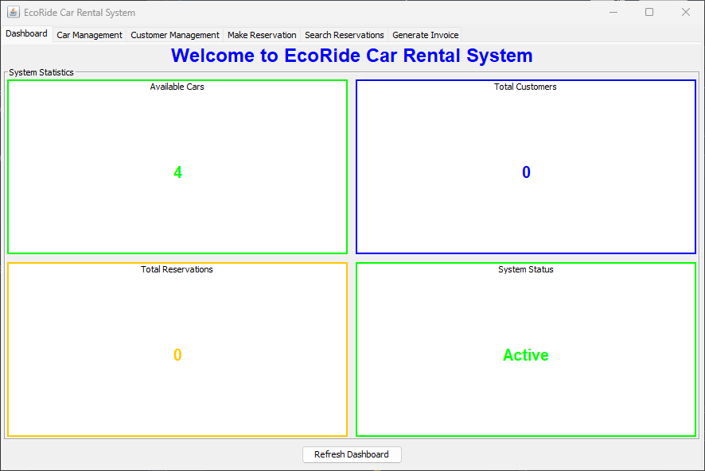
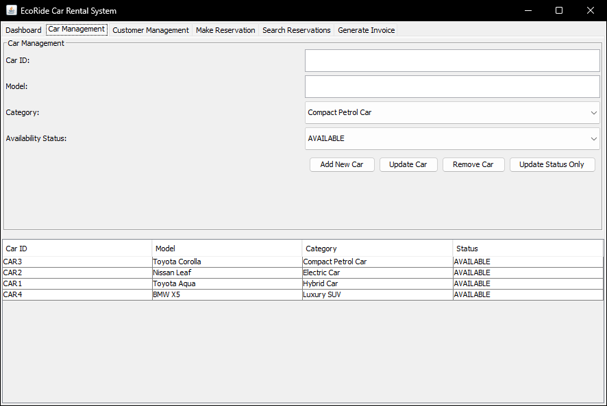
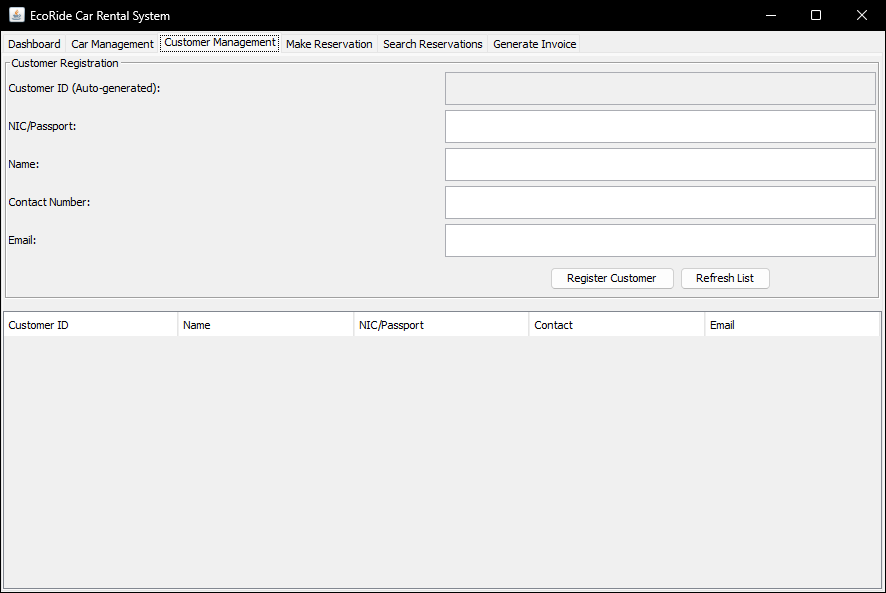
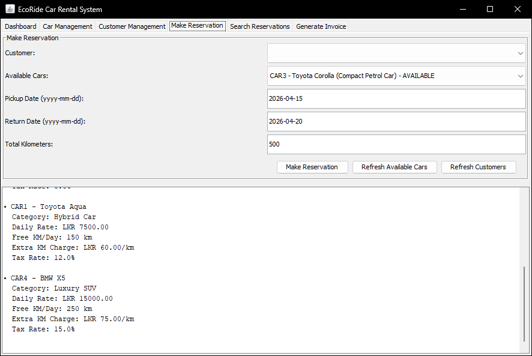
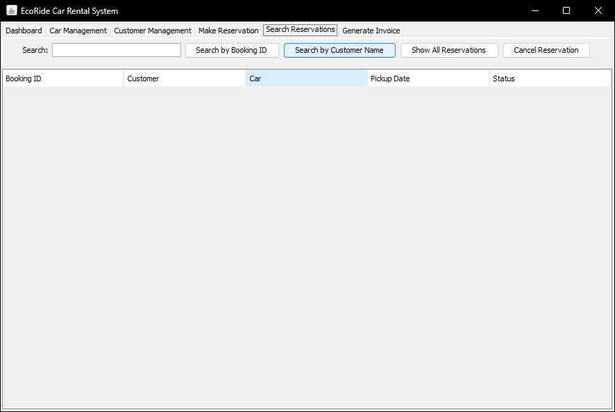
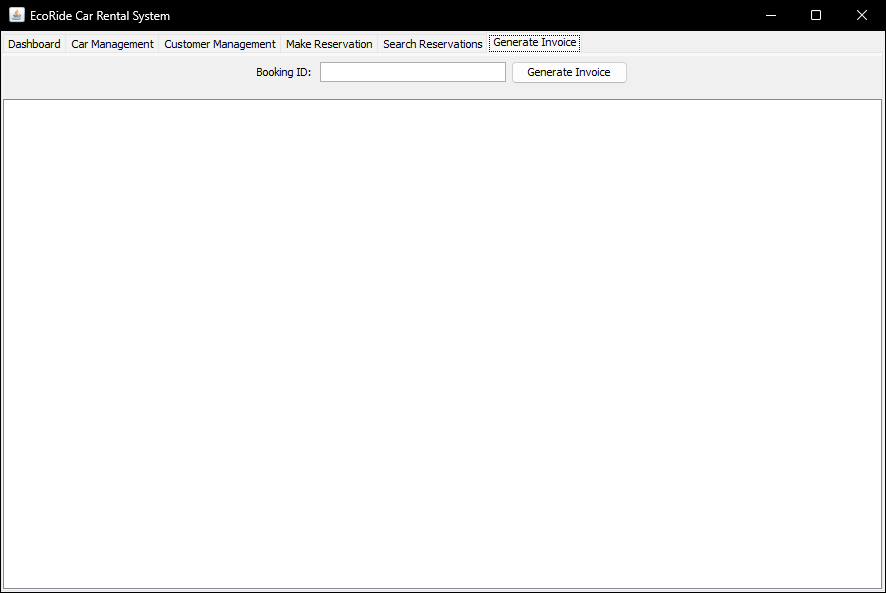
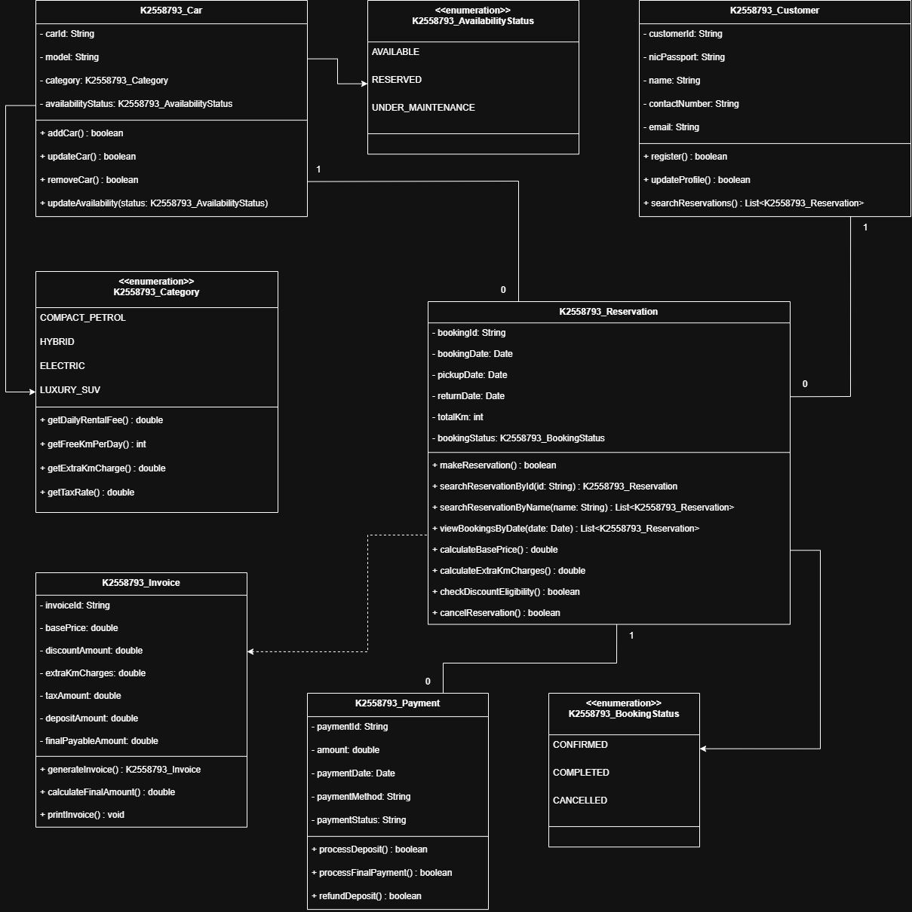

# EcoRide Car Rental System

> **Coursework 1** — CI6115 Programming: Patterns and Algorithms  
> KU BSc in Computing | ESOFT Metro Campus  
> **Student:** Sevin Dilneth &nbsp;|&nbsp; **ID:** K2558793

---

A Java Swing desktop application that manages the complete lifecycle of an eco-friendly car rental service — from fleet and customer management through to reservations, invoicing, and payment processing. Built using object-oriented design patterns with a layered architecture separating entities, business logic, data storage, and the GUI.

---

## Table of Contents

- [Screenshots](#screenshots)
- [Features](#features)
- [Car Categories & Pricing](#car-categories--pricing)
- [Business Rules](#business-rules)
- [Architecture](#architecture)
- [Project Structure](#project-structure)
- [Class Diagram](#class-diagram)
- [Getting Started](#getting-started)
- [Usage Guide](#usage-guide)
- [Tech Stack](#tech-stack)
- [Author](#author)

---

## Screenshots

### Dashboard
The main landing screen shows live system statistics — available cars, total registered customers, total reservations, and overall system status. Stats refresh automatically when switching back to this tab, or manually via the Refresh button.



---

### Car Management
Add new vehicles, update existing records, remove unavailable cars from the fleet, and control availability status (Available / Reserved / Under Maintenance). All cars are displayed in a live table that refreshes after every action.



---

### Customer Management
Register new customers with full input validation (name format, email, contact number length, alphanumeric NIC/Passport). Existing profiles can be updated, and the system prevents duplicate registrations for the same NIC/Passport number.



---

### Make Reservation
Book an available car for a customer by entering the Customer ID, Car ID, pickup/return dates, and total kilometres. Business rules (advance booking window, car availability) are enforced automatically. A confirmation result panel shows booking details and indicates whether a discount applies.



---

### Search Reservations
Look up reservations by exact Booking ID or by partial customer name match. Results are displayed in a table showing all key booking details and current status.



---

### Generate Invoice & Process Payment
Enter a Booking ID to generate a fully itemised invoice showing the base price, discount, extra KM charges, tax, and refundable deposit. Payments are processed in two stages: an upfront deposit, then a final settlement. Supports Cash, Card, and Bank Transfer.



---

## Features

- **Dashboard** — Live statistics cards for available cars, customers, reservations, and system status
- **Car Management** — Add, update, remove vehicles; manage per-car availability status across four eco categories
- **Customer Registration** — Full input validation with detailed per-field error messages; duplicate NIC/Passport detection
- **Reservation Booking** — Business rule enforcement (advance notice, car status check); auto-generated Booking IDs
- **Reservation Search** — Search by Booking ID or customer name (partial match)
- **Cancellation** — Time-gated cancellation with automatic car status reversion
- **Invoice Generation** — Automatic calculation of base price, discounts, extra KM charges, category-based tax, and deposit
- **Two-Stage Payments** — Refundable deposit collected first; final amount settled at return
- **Sample Data** — Four pre-loaded vehicles on startup for immediate testing

---

## Car Categories & Pricing

| Category | Daily Rental | Free KM/Day | Extra KM (LKR) | Tax Rate |
|---|---|---|---|---|
| Compact Petrol Car | LKR 5,000 | 100 km | 50 per km | 10% |
| Hybrid Car | LKR 7,500 | 150 km | 60 per km | 12% |
| Electric Car | LKR 10,000 | 200 km | 40 per km | 8% |
| Luxury SUV | LKR 15,000 | 250 km | 75 per km | 15% |

---

## Business Rules

| Rule | Detail |
|---|---|
| Advance booking | Reservation must be placed **≥ 3 days** before pickup |
| Cancellation window | Cancellations only allowed within **2 days** of booking date |
| Long-stay discount | **10% off** the base price for rentals of **7 or more days** |
| Refundable deposit | **LKR 5,000** collected upfront; deducted from final payment |
| Extra kilometres | Charged per km beyond the free daily allocation for that category |
| Car availability | Only cars with **AVAILABLE** status can be reserved |
| Removal restriction | Cars cannot be removed while in **RESERVED** or **UNDER MAINTENANCE** status |

---

## Architecture

The system uses a three-layer architecture:

```
┌────────────────────────────────────┐
│           UI Layer                 │  EcoRideGUI (Java Swing, JTabbedPane)
├────────────────────────────────────┤
│        Business Logic Layer        │  CarRentalManager — validates rules,
│                                    │  coordinates entities and storage
├────────────────────────────────────┤
│         Data / Storage Layer       │  DataStorage — HashMap-based in-memory
│                                    │  store; auto-generated IDs
└────────────────────────────────────┘
           │         │
     Entities      Enums
  (Car, Customer,  (Category, AvailabilityStatus,
  Reservation,     BookingStatus)
  Invoice, Payment)
```

Key design decisions:
- **HashMap storage** — O(1) lookup by ID for all entities
- **Enum-driven config** — Car categories carry their own pricing, free KM, and tax rate directly in the enum constants, eliminating magic numbers
- **Manager pattern** — `CarRentalManager` is the single entry point for all business operations; the GUI never touches `DataStorage` directly
- **Validation separation** — Customer input validation is centralised in `validateCustomerInputs()` and returns a field-keyed error map for precise UI feedback

---

## Project Structure

```
EcoRideCarRental/
├── src/main/java/com/ecoride/
│   ├── EcoRideApp.java                       # Entry point — launches Swing on EDT
│   │
│   ├── entities/
│   │   ├── K2558793_Car.java                 # Vehicle with ID, model, category, status
│   │   ├── K2558793_Customer.java            # Customer profile
│   │   ├── K2558793_Reservation.java         # Booking with pricing calculation methods
│   │   ├── K2558793_Invoice.java             # Itemised invoice (discount, tax, deposit)
│   │   └── K2558793_Payment.java             # Deposit and final payment records
│   │
│   ├── enums/
│   │   ├── K2558793_Category.java            # COMPACT_PETROL, HYBRID, ELECTRIC, LUXURY_SUV
│   │   ├── K2558793_AvailabilityStatus.java  # AVAILABLE, RESERVED, UNDER_MAINTENANCE
│   │   └── K2558793_BookingStatus.java       # CONFIRMED, CANCELLED
│   │
│   ├── manager/
│   │   └── CarRentalManager.java             # All business logic and rule enforcement
│   │
│   ├── storage/
│   │   └── DataStorage.java                  # HashMap collections + ID counters
│   │
│   └── ui/
│       └── EcoRideGUI.java                   # JFrame with 6-tab JTabbedPane
│
├── screenshots/                              # UI screenshots for documentation
├── out/artifacts/EcoRideCarRental_jar/
│   └── EcoRideCarRental.jar                  # Pre-built executable JAR
├── pom.xml                                   # Maven build config (Java 25)
└── README.md
```

---

## Class Diagram



---

## Getting Started

### Prerequisites

- **Java 25** (JDK) — the project is compiled targeting Java class version 69 (Java 25)
- **Maven 3.6+** (optional — only needed to recompile from source)

### Option 1 — Run the pre-built JAR

```bash
java -jar "out/artifacts/EcoRideCarRental_jar/EcoRideCarRental.jar"
```

### Option 2 — Build and run from source

```bash
git clone https://github.com/your-username/EcoRideCarRental.git
cd EcoRideCarRental
mvn package
java -jar target/EcoRideCarRental-1.0-SNAPSHOT.jar
```

> **Note:** Using Java 11 or below will throw `UnsupportedClassVersionError`. Ensure `JAVA_HOME` points to JDK 25.

---

## Usage Guide

### 1 — Register a Customer
Open the **Customer Management** tab → fill in NIC/Passport, name, contact number, and email → click **Register Customer**. The system validates each field and shows specific error messages if any input is invalid. Note the auto-generated **Customer ID** (e.g. `CUST1`).

### 2 — Add a Car (optional)
Four cars are pre-loaded on startup. To add more, go to **Car Management** → enter the model name → select a category → click **Add New Car**. Note the auto-generated **Car ID** (e.g. `CAR5`).

### 3 — Make a Reservation
Open **Make Reservation** → enter the Customer ID and Car ID from the previous steps → set pickup and return dates (at least 3 days from today) → enter the estimated total kilometres → click **Make Reservation**. The result panel confirms the booking and shows whether a discount applies.

### 4 — Generate an Invoice
Open **Generate Invoice** → enter the Booking ID → click **Generate Invoice**. The system computes and displays the full itemised breakdown. Click **Process Deposit** to record the LKR 5,000 deposit payment, then **Final Payment** at the end of the rental.

### 5 — Search or Cancel
Use **Search Reservations** to look up any booking by ID or customer name. To cancel, enter the Booking ID on the **Make Reservation** tab and click **Cancel Reservation** (only available within 2 days of booking).

---

## Tech Stack

| Component | Technology |
|---|---|
| Language | Java 25 |
| GUI Framework | Java Swing (JFrame, JTabbedPane, JTable) |
| Build Tool | Apache Maven |
| Data Storage | In-memory HashMaps |
| IDE | IntelliJ IDEA |
